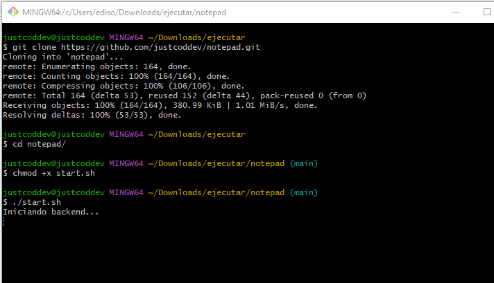
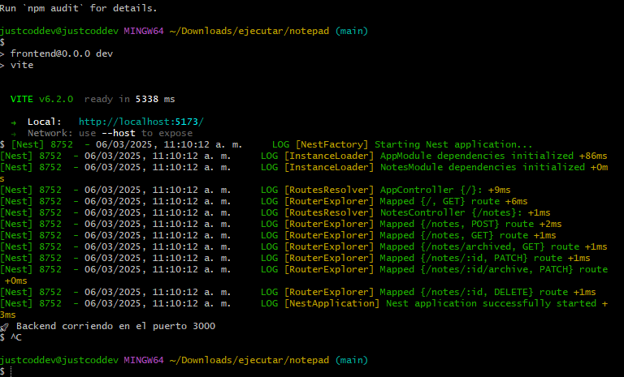
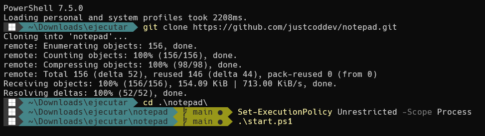
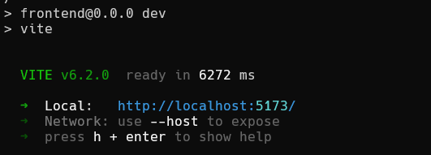
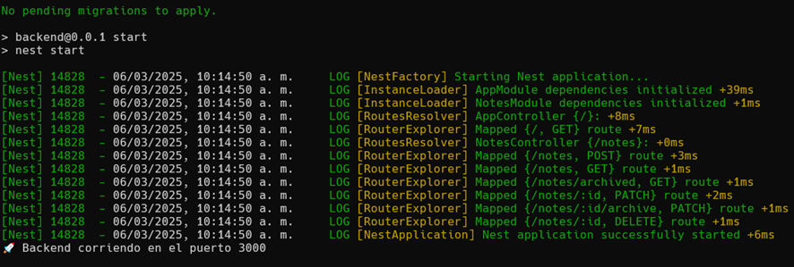

# 📝 Notepad App

Web application for taking notes with archiving options.

## ✅ Features

✔ **Create, edit, and delete notes**.  
✔ **Archive and unarchive notes**.  
✔ **List active and archived notes**.  
✔ **Data persistence using a relational database (PostgreSQL) with Prisma ORM**.  
✔ **Frontend and backend separated as a SPA**.  
✔ **Layered backend structure (Controllers, Services, and Repositories)**.  

## 🚀 Technologies Used

### 🎨 Frontend
- **React (Vite)**
- **TailwindCSS**
- **React Router DOM**
- **Zustand**
- **Zod**
- **Axios**
- **SweetAlert2**
- **Framer Motion**
- **@tanstack/react-query**
- **Lucide React**
- **@fontsource-variable/roboto**

### ⚙️ Backend
- **NestJS**
- **[Prisma ORM](https://www.prisma.io/)**  
- **[Neon PostgreSQL](https://neon.tech/)**  
- **Class Validator & Class Transformer**

## 🛠 System Requirements

- **Node.js** `22.11+`
- **NPM** `11+`
- **Neon PostgreSQL** `(cloud database, configured via DATABASE_URL)`

## 📝 Installation and Execution

### **Run the script on Linux/macOS (Bash/Zsh)**

1. **Clone the repository:**  
   ```sh
   git clone https://github.com/justcoddev/notepad.git
   cd notepad
   ```

2. **Give execution permissions to the script (only once):**  
   ```sh
   chmod +x start.sh
   ```

3. **Run the script:**  
   ```sh
   ./start.sh
   ```

     
   

✅ **If everything is correct, the backend and frontend will start automatically.** 🚀  

### **Run the script on Windows (PowerShell)**

1. **Clone the repository:**  
   ```sh
   git clone https://github.com/justcoddev/notepad.git
   cd notepad
   ```

2. **Open CMD or PowerShell in the project folder**  
   - In **CMD**: Type `powershell` and press **Enter** to switch to PowerShell.  
   - In **PowerShell**: Make sure you are in the `notepad` folder.  

3. **Allow script execution (only once):**  
   ```powershell
   Set-ExecutionPolicy Unrestricted -Scope Process
   ```
   🔹 This will prompt for confirmation. Type `A` (Yes to All) and press **Enter**.  

4. **Run the script:**  
   ```powershell
   .\start.ps1
   ```

     
     
   

✅ **If everything is correct, the backend and frontend will start automatically.** 🚀  


## 🌍 Deployment on Render

### 🔧 Backend

1. Run:
   ```sh
   npx prisma migrate deploy
   ```
2. Go to [Render](https://render.com).
3. Click **New + → Web Service**.
4. Select the `notepad` repository.
5. Configure:
   - **Root Directory:** `backend`
   - **Build command:** `npm install && npx prisma migrate deploy && npm run build`
   - **Start command:** `npm run start`
   - **Environment Variables:** `DATABASE_URL = *****`
6. Copy the backend URL.

### 🎨 Frontend

1. Create a `.env` file and add the backend URL:
   ```sh
   VITE_API_URL=*****
   ```
2. Go to [Render](https://render.com).
3. Click **New + → Static Site**.
4. Select the `notepad` repository.
5. Configure:
   - **Root Directory:** `frontend`
   - **Build command:** `npm install && npm run build`
   - **Publish Directory:** `dist`
   - **Environment Variables:** `VITE_API_URL = *****`

## 🌐 Project URLs
- **Design:** [🔗 https://www.figma.com/design/5h5eEZilWXYu1rc3nFkT0U/NotePad?node-id=0-1&t=iFfwcBCFKCWEnpkH-1](https://www.figma.com/design/5h5eEZilWXYu1rc3nFkT0U/NotePad?node-id=0-1&t=iFfwcBCFKCWEnpkH-1)
- **Backend:** [🔗 https://notepad-0v1f.onrender.com/notes](https://notepad-0v1f.onrender.com/notes)
- **Frontend:** [🔗 https://my-notepad-t7re.onrender.com/](https://my-notepad-t7re.onrender.com/)